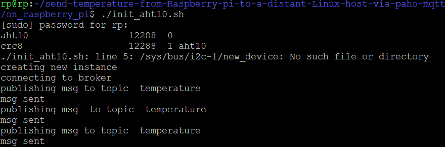

# version1: send-temperature-from-Raspberry-pi-to-a-distant-Linux-host-via-paho-mqtt-1.6.1
3 scripts:
* a shell script that initializes the kernel module for AHT10 temperature sensor (init_aht10.sh)
* a python script (publisher) on the raspberry pi that publishes temperature values (pub.py)
* a python script (subscriber) on the linux host that recieves the temperature values and prints them (sub.py)

## there is also a version2: in the directory: v2-send-simulated-temperature-values-in-an-infinite-loop 
  
**P.S:** the shell script calls the python publisher script (init_aht10.sh calls pub.py)
## getting-started:
⚠️ Os must be ubuntu 24 LTS or newer so that the aht10 module is integrated to the kernel
### on the distant linux host:
```bash
git clone https://github.com/mimou-77/send-temperature-from-Raspberry-pi-to-a-distant-Linux-host-via-paho-mqtt.git
```
work only with the directory "on_distant_Linux_host" containing the files that need to be on the distant linux host (the python script: subscriber)
```bash
cd send-temperature-from-Raspberry-pi-to-a-distant-Linux-host-via-paho-mqtt
git sparse-checkout set on_distant_Linux_host
git checkout
```
### on the distant Linux host AND on the raspberry pi:
```bash
sudo apt install python3
```
```bash
sudo apt install pip
```
> p.s: if the previous command doesn't work (unable to locate package) do this:
> ```bash
> sudo apt install linux-generic
> ```
> ```bash
> sudo apt update
> ```
make sure you have the older version of paho-mqtt (version 1.6.1) otherwise nothing will work
```bash
pip install paho-mqtt==1.6.1
```
> if you have the following error after **pip install paho-mqtt==1.6.1** : "error: externally-managed-environment" do this:
> ```bash
> pip install --break-system-packages paho-mqtt==1.6.1
> ```
### on the raspberry pi:
```bash
git clone https://github.com/mimou-77/send-temperature-from-Raspberry-pi-to-a-distant-Linux-host-via-paho-mqtt.git
```
work only with the directory "on_raspberry_pi" containing the files that need to be on the raspberry pi (the shell script: initialization of the module driver for the sensor + the python script: publisher)
```bash
cd send-temperature-from-Raspberry-pi-to-a-distant-Linux-host-via-paho-mqtt
git sparse-checkout set on_raspberry_pi
git checkout
```
#### check if you have the driver kernel-module for the AHT10 sensor on your raspberry pi:
on the raspberry pi:
```bash
find /lib/modules/ -iname aht10*
```
if the module is found: skip to step (*)
if the module isn't found: do the followig:
```bash
sudo apt install linux-generic
```
check if the module is now available:
```bash
find /lib/modules/ -iname aht10*
```
### step (*): execute the 2 scripts simultaneously 
on the distant Linux host: execute the the init script
```bash
cd on_raspberry_pi
./init_aht10.sh
```
on the raspberry pi: execute the subscriber script
```bash
cd on_distant_linux_host
python3 ./sub.py
```
#### you will see something similar to this:
on the raspberry pi:


on the distant linux host:


